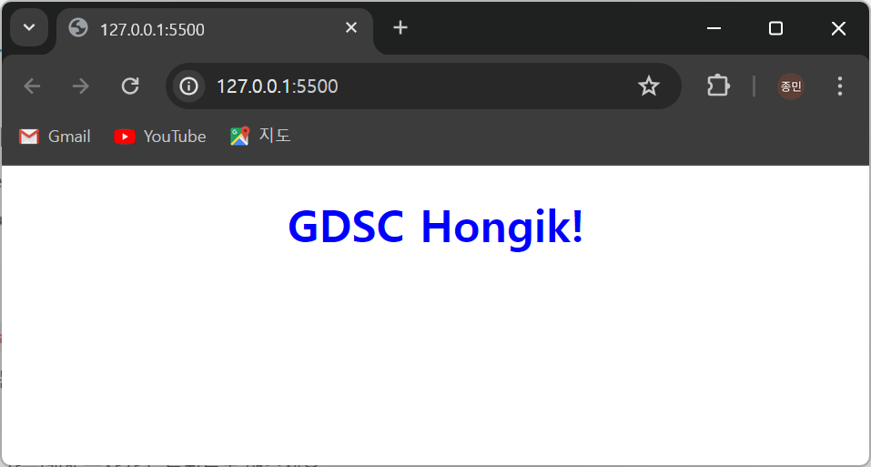

VScode를 사용하여 'GDSC Hongik!' 글자를 렌더링해보며 VScode를 사용하는 방법을 알게 되었습니다. 또한, html의 head 문법과 body 문법을 통해 웹에 글자를 출력하는 법을 알게 되었고 CSS의 color와 text-align을 통해 글자의 색을 바꾸고 정렬할 수 있게 되었고 ```<link>```를 통해 CSS 파일을 html 파일의 헤드 안에 import 할 수 있게 되었습니다.